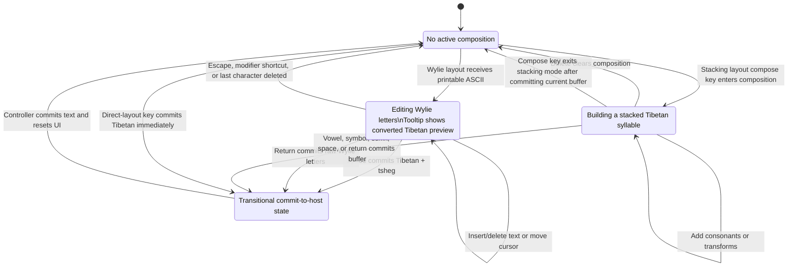

# Input Method State Diagram

This document reflects the current state model in `src/input_method/InputState.ts`.

The input method currently uses four concrete states:

- `EmptyState`: no active composition.
- `WylieInputtingState`: ASCII Wylie is being edited and previewed as Tibetan text.
- `StackingState`: a stacking layout is building a Tibetan syllable before commit.
- `CommittingState`: a transient state that carries text to the host application.

## Notes

- `InputtingState` is an abstract base class implemented by `WylieInputtingState` and `StackingState`.
- `InputController` does not remain in `CommittingState`; it commits the string, resets the UI, and returns to `EmptyState`.
- Direct layouts such as Dzongkha typically bypass an inputting state and emit `CommittingState` immediately for each handled key.
